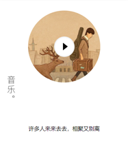

# 项目组件简介

## 1. classic 组件

  

movie组件、music组件、essay组件使用 behaviors（用于组件间代码共享）设置共同的 properties（组件的对外属性，是属性名到属性设置的映射表）。分别为：

+ img：String，组件显示的图片内容
+ content：string，组件显示的文本内容
+ hidden：Boolean，控制组件的显示和隐藏

### 1.1 classic/movie 组件、classic/essay 组件

movie组件 和 essay组件 主要用于内容的显示

### 1.2 classic/music 组件

mussic组件 除了对于内容的显示，还需要对音乐进行控制。

除了 behaviors（组件代码共享） 中的属性，music组件还存在如下属性：

+ src：组件播放音乐的src
+ title：组件播放音乐的音频标题

mussic组件 通过微信小程序API wx.getBackgroundAudioManager()（背景音频管理器） 对音乐进行控制。如果当期刊进行切换，切换到音乐期刊的时候，当前音乐期刊应保持暂停播放状态。所以可以通过当前播放的音乐src 与 当前期刊音乐src 进行比较，如果相同，则设置页面播放状态为播放，如果不相同，则播放状态为暂停

+ 当前播放音乐src：可以通过 wx.getBackgroundAudioManager(微信背景音频管理器) 获取
+ 当前音乐期刊src：可以通过 properties 中的 src 进行获取

注意：

+ 背景音频管理在真机测试时，会有音频管理显示在手机状态栏，所以需要状态栏控制与页面音频控制保持同步。
+ 当音频播放结束的时候，应停止播放音频，所以需要对 onEeded 事件进行监听，不要遗漏

## 2. navi 组件

## 3. episode 组件

## 4. like 组件

## 5. book 组件

## 6. search 组件

## 7. tag 组件

## 8. image-button 组件

## 9. loading 组件

## 10. mask 组件

## 11. preview 组件
